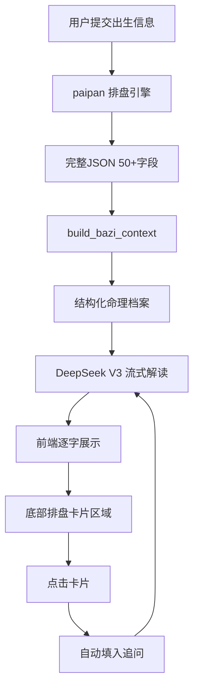

# 时安八字 AI 深度解读系统 — 设计方案

**日期**: 2026-05-27  
**状态**: 设计稿  
**关联项目**: 时安解忧屋 H5 (uni-app + Flask)

---

## 一、背景与目标

现有八字系统已具备：
- 完整的排盘引擎 (`bazi_engine.py`, ~4000行)，返回50+命理字段
- SSE 流式 AI 解读（DeepSeek V3）
- 追问机制 + 排盘结果页（问真风格）

**当前问题**：
1. AI Prompt 只传了部分数据，大量专业字段（神煞、藏干十神、十二长生、干支关系等）被遗漏
2. AI 解读后缺乏可交互的排盘卡片深挖功能
3. Bug：AI 深度解读时 `baiDate.value` 因初始化未触发回调而保持空值，报"请选择出生日期"

**目标**：
- 全量排盘数据（50+字段）结构化传递给 AI
- AI 先输出综合解读，底部展示排盘模块卡片，点击卡片追问深挖
- 修复日期为空 Bug

---

## 二、整体架构



### 数据流

1. 用户点击「AI深度解读」→ 前端发送出生信息到 `/api/bazi/ask/stream`
2. 后端调用 `paipan()` 获取完整排盘数据
3. 后端调用 `_build_bazi_context(pan_data)` 构建结构化命理档案
4. 档案嵌入 DeepSeek system prompt，流式生成综合解读
5. 解读完成 → 前端显示排盘卡片区域
6. 用户点击卡片 → 触发预设追问 → 流式输出该模块深度解读

---

## 三、后端设计

### 3.1 新增文件: `bazi_prompt.py`

专门构建八字 Prompt 结构，约 200 行。

```
bazi_prompt.py
├── build_bazi_context(pan_data) → str
│   接收 paipan() 完整JSON → 生成结构化命理档案
│
├── build_system_prompt(context, analysis_type) → str
│   将context嵌入命理师角色设定
│   analysis_type 决定侧重点
│
└── format_section(title, content) → str
    格式化模块区块
```

### 3.2 结构化命理档案 (8大模块)

| 模块 | 包含字段 | 数据来源 |
|------|---------|---------|
| 基础信息 | 姓名、性别、公历/农历生日、生肖、星座、真太阳时 | pan_data |
| 四柱排盘 | 年/月/日/时柱：干支、纳音、藏干+十神、空亡 | four_pillars, cang_gan, shi_shen |
| 五行全局 | 五行分布计数、日主旺衰、旺相休囚死、调候用神 | wu_xing, wang_shuai, tiaohou |
| 十神分析 | 四柱天干十神、地支藏干十神、十神统计 | shi_shen, cang_gan_shi_shen |
| 神煞系统 | 四柱神煞列表 | shen_sha_per_pillar |
| 大运流年 | 起运岁数、顺逆、大运序列、当前大运、当前流年 | da_yun, liu_nian, qi_yun_detail |
| 十二长生 | 四柱星运/地势/自坐 | xing_yun, di_shi, zi_zuo |
| 高级命理 | 格局、称骨、胎命身、命卦、星宿、干支关系、古籍参考 | geju, cheng_gu, guji_refs, ganzhi_relations |

### 3.3 `app.py` 改动

在 `_bazi_ask_task()` 中：

```python
# 新增：构建结构化命理档案
from bazi_prompt import build_bazi_context, build_system_prompt

# 排盘完成后
pan_data = bazi_engine.paipan(...)

# 保存完整排盘数据供卡片追问
with open(f"{run_dir}/pan_full.json", 'w') as f:
    json.dump(pan_data, f, ensure_ascii=False)

# 构建 Prompt
context = build_bazi_context(pan_data)
system_prompt = build_system_prompt(context, analysis_type)
# → 替换现有硬编码的 system prompt
```

### 3.4 追问增强

当用户通过卡片点击追问时，将 `pan_full.json` 完整排盘数据随问题一起传递给 AI，确保卡片追问也能获得完整的命理上下文。

---

## 四、前端设计

### 4.1 卡片容器（新增）

解读气泡完成后，底部显示排盘卡片网格：

```
[baziChatContainer]    ← 对话气泡（AI综合解读  +  用户追问）
[baziChatInputBar]     ← 追问输入框+发送按钮
[baziCardsSection]     ↓ 新增：排盘卡片区域
  ┌──────────────────────────────────┐
  │  ☯ 四柱排盘  🔥 五行分析  📊 大运流年 │
  │  🌟 十神神煞  🌱 十二长生  ⚡ 命理格局 │
  └──────────────────────────────────┘
```

2列×3行网格布局，每张卡片包含：
- 图标（Emoji）
- 标签名
- 触摸高亮效果

### 4.2 `openCardAnalysis(module)` 函数

点击卡片时自动在追问输入框填入预设深度问题，并触发追问：

| 卡片 | 预设追问内容 |
|------|-------------|
| 四柱排盘 | "请详细分析我的四柱排盘，各柱藏干十神对命局的影响" |
| 五行分析 | "详细分析我的五行分布、喜用神和忌神，给出调候建议" |
| 大运流年 | "详细分析我的大运走势，当前大运的吉凶和注意事项" |
| 十神神煞 | "分析我的十神配置和神煞，它们在命局中的具体影响" |
| 十二长生 | "分析我的十二长生分布，对事业、健康、财运的启示" |
| 命理格局 | "分析我的命理格局、命卦、干支关系，以及称骨论断" |

### 4.3 卡片显示时机

在 `baiAiAsk()` 的 `onDone` 回调中设置 `cardsSection.style.display = 'block'`

### 4.4 卡片样式

- 圆角 14px，毛玻璃背景（同现有卡片风格）
- 浅色/深色主题自适应（CSS 变量）
- 触摸高亮 + 微动效
- 网格 gap: 12px

---

## 五、Bug修复

### 问题：AI深度解读提示"请选择出生日期"

**根因**：`fillBaziSelect()` 的 `onChange` 回调只在用户交互时触发。初始化后 `updateBaiDate()` 从未被调用，`baiDate.value` 保持空字符串。

**修复**：在 `onMounted` 填充 AI 版日期 select 后立即调用 `updateBaiDate()`。

**改动位置**：`src/pages/bazi-index/index.vue` 第 1448 行

---

## 六、文件变更清单

| 文件 | 类型 | 改动量 | 说明 |
|------|------|--------|------|
| `flask-source/backend/bazi_prompt.py` | 新增 | ~200行 | 构建命理档案+Prompt模板 |
| `flask-source/backend/app.py` | 修改 | ~60行 | 调用bazi_prompt，保存pan_full.json |
| `flask-source/backend/deepseek_service.py` | 修正 | ~20行 | 支持分段传参 |
| `src/pages/bazi-index/index.vue` | 修改 | ~120行 | 卡片HTML+JS+CSS，Bug修复 |
| `src/pages/bazi-result/index.vue` | 不改 | — | — |

---

## 七、实施顺序

1. `bazi_prompt.py` — 核心 Prompt 构建
2. `app.py` — 改造 `_bazi_ask_task()`
3. `bazi-index/index.vue` — 卡片 + Bug 修复
4. 测试 + 构建部署
